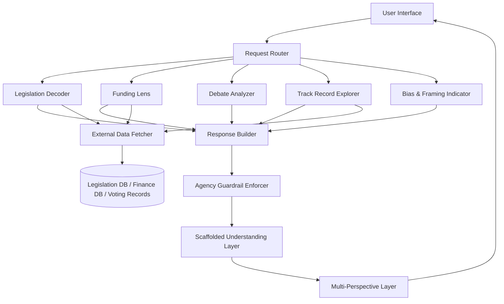

# Design Document: Hexagon Civic Literacy

## Overview

Hexagon is an AI-powered civic literacy assistant that helps users read, interpret, and contextualize political information. It operates as a structured analytical layer over political data sources — legislation, campaign finance records, debate transcripts, voting histories, and political text — presenting information through named analytical frameworks while strictly enforcing an Agency Guardrail that prohibits normative political judgments.

The system is composed of five analytical modules (Legislation Decoder, Funding Lens, Debate Analyzer, Track Record Explorer, Bias & Framing Indicator) plus two cross-cutting behaviors (Scaffolded Understanding and Multi-Perspective Context) that apply to every module's output.

The design prioritizes:
- **Neutrality by construction**: the Agency Guardrail is enforced at the response-generation layer, not as a post-hoc filter
- **Transparency of reasoning**: every response names the analytical framework being applied
- **User agency**: responses end with open-ended questions rather than conclusions

---

## Architecture

Hexagon follows a layered pipeline architecture:



**Key architectural decisions:**

1. **Guardrail as a pipeline stage**: The Agency Guardrail Enforcer sits between raw module output and the user. This ensures no module can accidentally emit normative language regardless of how it is implemented.

2. **Shared cross-cutting layers**: Scaffolded Understanding and Multi-Perspective Context are applied as post-processing layers rather than being re-implemented in each module. This guarantees consistent behavior across all five features.

3. **Separation of data retrieval from analysis**: Modules that require external data (Legislation Decoder, Funding Lens, Track Record Explorer) delegate retrieval to a shared Data Fetcher. This isolates external API dependencies and makes the analytical logic independently testable.

---

## Components and Interfaces

### Request Router

Classifies incoming user requests and dispatches to the appropriate module. Also handles ambiguous requests by prompting the user for clarification.

```typescript
interface RoutedRequest {
  moduleId: 'legislation' | 'funding' | 'debate' | 'trackrecord' | 'framing';
  sourceText?: string;       // user-submitted text
  entityId?: string;         // bill ID, candidate name, etc.
  conversationHistory: Turn[];
}
```

### Module Interface (shared by all five modules)

Each module implements a common interface:

```typescript
interface AnalysisModule {
  analyze(request: RoutedRequest): Promise<RawAnalysis>;
}

interface RawAnalysis {
  moduleId: string;
  sections: AnalysisSection[];
  frameworksApplied: string[];
  factualClaims: FactualClaim[];
  perspectives: Perspective[];
  dataGaps?: DataGap[];
}

interface AnalysisSection {
  title: string;
  content: string;
  contentType: 'fact' | 'inference' | 'opinion' | 'framework' | 'prompt';
}

interface FactualClaim {
  text: string;
  verifiable: boolean;
  evidenceProvided: boolean;
  source?: string;
}

interface Perspective {
  stakeholderGroup: string;
  analyticalTradition?: string;
  content: string;
}

interface DataGap {
  description: string;
  primarySources: string[];
}
```

### Agency Guardrail Enforcer

Scans `RawAnalysis` output for normative language patterns and either removes/rewrites offending content or replaces the response with a scope-boundary message.

```typescript
interface GuardrailResult {
  passed: boolean;
  sanitizedAnalysis?: RawAnalysis;
  scopeBoundaryMessage?: string;
  violations: GuardrailViolation[];
}

interface GuardrailViolation {
  sectionTitle: string;
  offendingText: string;
  violationType: 'endorsement' | 'normative_language' | 'recommendation';
}
```

### Scaffolded Understanding Layer

Appends open-ended analytical questions to every response and names the framework being applied.

```typescript
interface ScaffoldedResponse {
  analysis: RawAnalysis;
  frameworkLabel: string;
  closingQuestions: string[];
  alternativeFrameworks?: string[];
}
```

### Multi-Perspective Layer

Ensures every response contains at least two perspectives (or explains why only one exists for factual consensus matters).

```typescript
interface FinalResponse {
  scaffolded: ScaffoldedResponse;
  perspectivesVerified: boolean;
  perspectiveCount: number;
}
```

### External Data Fetcher

Abstracts calls to legislation databases, campaign finance APIs, and voting record archives.

```typescript
interface DataFetcher {
  fetchLegislation(billId: string): Promise<LegislationRecord | null>;
  fetchFinanceData(entityId: string): Promise<FinanceRecord | null>;
  fetchVotingRecord(politicianId: string): Promise<VotingRecord | null>;
}
```

---

## Data Models

### LegislationRecord

```typescript
interface LegislationRecord {
  billId: string;
  title: string;
  fullText: string;
  statedPurpose: string;
  keyProvisions: Provision[];
  affectedParties: string[];
  proceduralStage: ProceduralStage;
  glossaryTerms: GlossaryEntry[];
}

type ProceduralStage =
  | 'introduced'
  | 'committee_review'
  | 'floor_vote'
  | 'passed_chamber'
  | 'conference'
  | 'signed'
  | 'vetoed';

interface Provision {
  id: string;
  summary: string;
  affectedParties: string[];
}

interface GlossaryEntry {
  term: string;
  definition: string;
}
```

### FinanceRecord

```typescript
interface FinanceRecord {
  entityId: string;
  entityName: string;
  contributions: Contribution[];
  totalRaised: number;
  reportingPeriod: DateRange;
  legalContext: string;
  benchmarks: FinanceBenchmark[];
}

interface Contribution {
  donorCategory: string;
  donorName?: string;
  amount: number;
  date: string;
  disclosureStatus: 'disclosed' | 'undisclosed' | 'partial';
}

interface FinanceBenchmark {
  label: string;
  value: number;
  description: string;
}

interface DateRange {
  start: string;
  end: string;
}
```

### VotingRecord

```typescript
interface VotingRecord {
  politicianId: string;
  politicianName: string;
  votes: VoteEntry[];
  publicStatements: PublicStatement[];
}

interface VoteEntry {
  billId: string;
  billTitle: string;
  billPurpose: string;
  policyArea: string;
  date: string;
  vote: 'yea' | 'nay' | 'abstain' | 'absent';
  finalOutcome: 'passed' | 'failed';
}

interface PublicStatement {
  date: string;
  text: string;
  topic: string;
  relatedBillId?: string;
}
```

### DebateAnalysis

```typescript
interface DebateAnalysis {
  sourceText: string;
  arguments: ArgumentStructure[];
  rhetoricalTechniques: RhetoricalTechnique[];
  factualClaims: FactualClaim[];
}

interface ArgumentStructure {
  speakerId: string;
  claim: string;
  evidence?: string;
  warrant?: string;
  charitableInterpretation: string;
  logicalGaps: string[];
}

interface RhetoricalTechnique {
  name: string;
  excerpt: string;
  function: string;
}
```

### FramingAnalysis

```typescript
interface FramingAnalysis {
  sourceText: string;
  loadedPhrases: LoadedPhrase[];
  structuralChoices: StructuralChoice[];
  framingPatternsDetected: boolean;
  criteriaApplied: string[];
}

interface LoadedPhrase {
  original: string;
  connotativeWeight: string;
  framingEffect: string;
  neutralAlternative: string;
}

interface StructuralChoice {
  type: 'ordering' | 'omission' | 'passive_voice' | 'emphasis' | 'other';
  description: string;
  potentialEffect: string;
}
```

### Conversation Turn

```typescript
interface Turn {
  role: 'user' | 'assistant';
  content: string;
  moduleId?: string;
  frameworksApplied?: string[];
}
```

---

## Correctness Properties

*A property is a characteristic or behavior that should hold true across all valid executions of a system — essentially, a formal statement about what the system should do. Properties serve as the bridge between human-readable specifications and machine-verifiable correctness guarantees.*

### Property 1: Guardrail Output Cleanliness

*For any* political query or analysis request, the final response produced by the Agency Guardrail Enforcer SHALL contain no endorsement language, no normative or prescriptive political language (e.g., "you should support", "the right choice is"), no characterization of funding as evidence of corruption or improper intent, no declaration of a debate winner, and no labeling of source framing as intentionally biased.

**Validates: Requirements 1.1, 1.2, 3.3, 4.4, 5.2, 6.2**

---

### Property 2: Redirect to Framework

*For any* user query that requests a political recommendation, a direct conclusion, or a summary judgment on a political matter, the response SHALL contain a named Analytical_Framework and at least one open-ended question, and SHALL NOT contain a recommendation or conclusory assertion.

**Validates: Requirements 1.3, 7.2**

---

### Property 3: Content Type Labeling

*For any* analysis output, every AnalysisSection in the sections array SHALL have a non-null contentType drawn from the set {fact, inference, opinion, framework, prompt}, and the set of contentTypes present in the response SHALL include at least one of {fact, inference}.

**Validates: Requirements 1.4**

---

### Property 4: Legislation Structured Output

*For any* valid legislative input (bill identifier or legislative Source_Text), the Legislation_Decoder output SHALL contain: a non-empty statedPurpose, at least one Provision in keyProvisions, at least one entry in affectedParties, a valid ProceduralStage with a human-readable explanation, a non-empty glossaryTerms array when the input contains legal jargon, and a "What to look for" section whose content contains at least one question (ending with '?').

**Validates: Requirements 2.1, 2.2, 2.3, 2.5**

---

### Property 5: Finance Structured Output

*For any* valid campaign finance request, the Funding_Lens output SHALL contain: contributions organized with donorCategory, amount, and date fields populated; a non-empty benchmarks array; and a non-empty legalContext string.

**Validates: Requirements 3.1, 3.2, 3.4**

---

### Property 6: Debate Structured Output

*For any* debate transcript or speech input of 100 words or more, the Debate_Analyzer output SHALL contain: at least one ArgumentStructure with a non-empty claim and a non-empty charitableInterpretation; at least one RhetoricalTechnique with a non-empty function description; and at least one FactualClaim with verifiable and evidenceProvided fields set.

**Validates: Requirements 4.1, 4.2, 4.3, 4.4**

---

### Property 7: Short Input Rejection

*For any* debate or speech Source_Text with a word count strictly less than 100, the Debate_Analyzer SHALL return a notification response requesting a more complete source rather than an analysis output.

**Validates: Requirements 4.6**

---

### Property 8: Track Record Structured Output

*For any* valid politician track record request, the Track_Record_Explorer output SHALL contain: VoteEntry objects with non-empty policyArea, date, and finalOutcome fields; divergence surfacing for any statement/vote pairs that conflict; and a pattern-identification prompt in question form (containing '?').

**Validates: Requirements 5.1, 5.2, 5.3, 5.4**

---

### Property 9: Framing Analysis Structured Output

*For any* Source_Text submitted for framing analysis that contains identifiable loaded language, the Bias_Framing_Indicator output SHALL contain: at least one LoadedPhrase with non-empty framingEffect and non-empty neutralAlternative; and at least one StructuralChoice when structural framing patterns are present.

**Validates: Requirements 6.1, 6.2, 6.3**

---

### Property 10: Framing Consistency Across Political Orientations

*For any* pair of Source_Texts that contain equivalent framing patterns but are associated with different political orientations or ideological affiliations, the Bias_Framing_Indicator SHALL produce outputs with an equivalent number of identified LoadedPhrases and StructuralChoices (within ±1 of each other).

**Validates: Requirements 6.4**

---

### Property 11: Scaffolded Output Structure

*For any* analysis output from any module, the ScaffoldedResponse SHALL contain: a non-empty frameworkLabel naming the interpretive lens applied, and at least one entry in the closingQuestions array.

**Validates: Requirements 7.1, 7.3**

---

### Property 12: No Verbatim Repetition in Follow-Ups

*For any* multi-turn conversation where the user engages with a follow-up question, the assistant's follow-up response SHALL NOT contain any verbatim sentence (10 or more consecutive words) that appeared in the immediately preceding assistant response.

**Validates: Requirements 7.4**

---

### Property 13: Multi-Perspective Coverage and Balance

*For any* analysis output on a contested political topic, the perspectives array SHALL contain at least two entries with distinct stakeholderGroup values; each Perspective SHALL have a non-empty stakeholderGroup and non-empty content; and no perspective's content length SHALL exceed twice the length of any other perspective's content in the same response.

**Validates: Requirements 8.1, 8.2, 8.3, 2.4**

---

## Error Handling

### Invalid or Unrecognized Source Text

Each module validates its input before analysis:

- **Legislation Decoder**: If the submitted text is not recognizable as a legislative document (no bill structure, no provisions, no legislative identifiers), return a `DataGap` response with a message requesting a valid legislative source. (Requirement 2.6)
- **Debate Analyzer**: If the submitted text is fewer than 100 words or not recognizable as political speech/debate content, return a notification requesting a more complete source. (Requirement 4.6)
- **Bias & Framing Indicator**: If no framing patterns are detected, return a `framingPatternsDetected: false` response with `criteriaApplied` populated to explain what was checked. (Requirement 6.6)

### Unavailable External Data

When the Data Fetcher cannot retrieve requested data:

- **Funding Lens**: Return a `DataGap` with a description of what data is missing and a list of `primarySources` the user can consult directly (e.g., FEC.gov, OpenSecrets). (Requirement 3.6)
- **Track Record Explorer**: Return a `DataGap` with guidance to official congressional records or public archives. (Requirement 5.5)

### Scope Boundary (Guardrail Trigger)

If the Agency Guardrail Enforcer determines that a response cannot be generated without expressing a normative political judgment, it returns a `scopeBoundaryMessage` that:
1. Informs the user the question falls outside Hexagon's scope
2. Offers a neutral reframing of the inquiry
3. Does not attempt to answer the original question

(Requirement 1.5)

### One-Sided Request

If a user explicitly requests only one side of an issue, the Multi-Perspective Layer intercepts the request and:
1. Explains Hexagon's multi-perspective commitment
2. Offers to present the requested perspective alongside at least one alternative
3. Does not refuse the request outright

(Requirement 8.5)

---

## Testing Strategy

### Dual Testing Approach

Hexagon's testing strategy combines unit/example-based tests for specific behaviors with property-based tests for universal correctness guarantees.

**Unit / Example-Based Tests** cover:
- Scope boundary responses for queries that cannot be answered neutrally (Requirement 1.5)
- Non-legislative input rejection by the Legislation Decoder (Requirement 2.6)
- Unavailable data responses from Funding Lens and Track Record Explorer (Requirements 3.6, 5.5)
- Neutral text producing `framingPatternsDetected: false` (Requirement 6.6)
- Comparison view availability in track record responses (Requirement 5.6)
- One-sided request handling by the Multi-Perspective Layer (Requirement 8.5)

**Property-Based Tests** cover all 13 correctness properties above. Each property test must:
- Run a minimum of **100 iterations** per property
- Use a property-based testing library appropriate for the implementation language (e.g., `fast-check` for TypeScript/JavaScript, `hypothesis` for Python, `QuickCheck` for Haskell)
- Be tagged with a comment in the format: `Feature: hexagon-civic-literacy, Property {N}: {property_text}`

### Property Test Notes

- **Property 1 (Guardrail Cleanliness)**: Generators should produce varied political queries across topics, tones, and phrasing styles. The guardrail check is a pattern-match against a defined set of prohibited language patterns.
- **Property 10 (Framing Consistency)**: Generators should produce matched pairs of texts — same framing structure, different political orientation. The metamorphic oracle checks that analysis depth is equivalent.
- **Property 12 (No Verbatim Repetition)**: Generators should produce multi-turn conversation histories. The oracle checks for 10+ consecutive word matches between consecutive assistant turns.
- **Property 13 (Perspective Balance)**: The length ratio check (≤2:1) is the machine-verifiable proxy for "equivalent depth and clarity."

### Integration Tests

The following behaviors require integration tests against real or mocked external data sources:
- Data Fetcher retrieval for legislation, finance, and voting records
- End-to-end pipeline from user query through all layers to final response
- Conversation history threading across multiple turns
