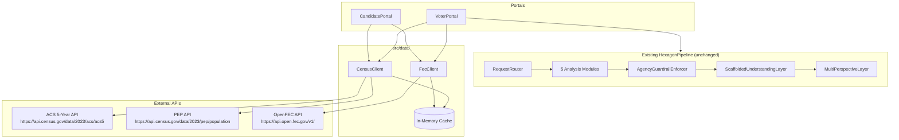
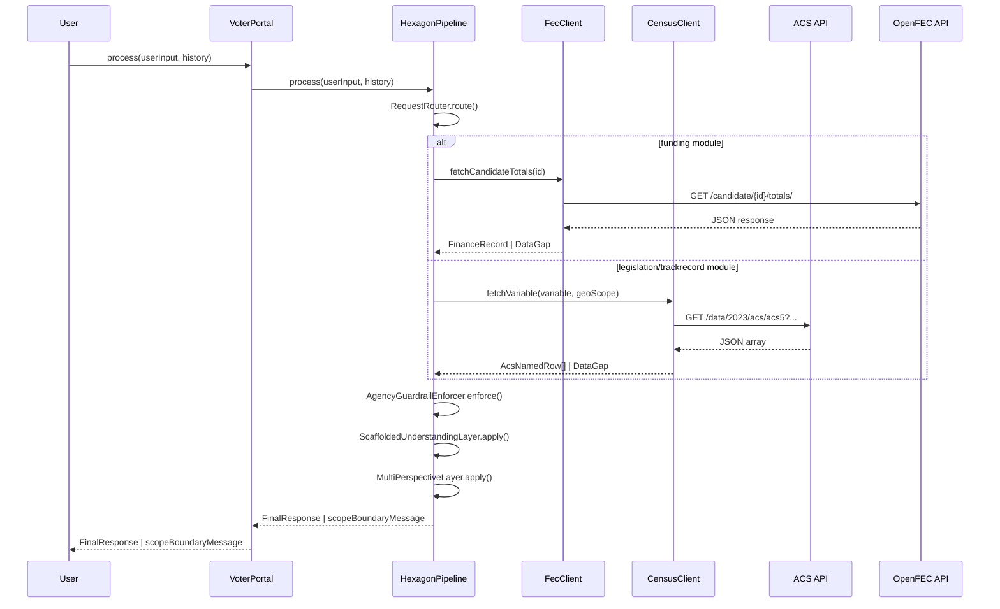
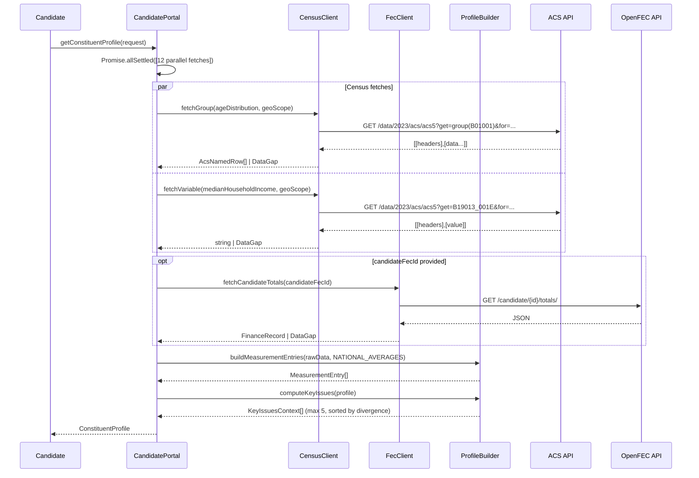
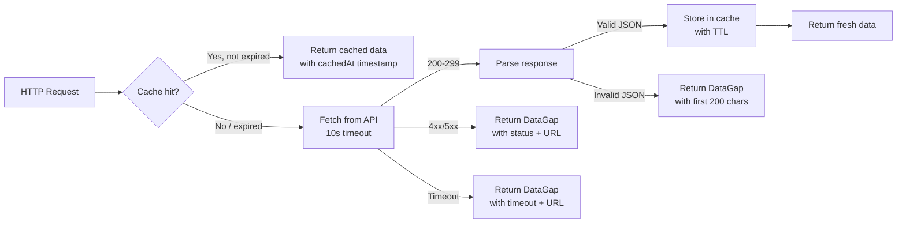

# Design Document: Hexagon Portals

## Overview

This feature adds two new entry points — **VoterPortal** and **CandidatePortal** — to the Hexagon Civic Literacy platform, backed by live data from free public APIs. It also replaces the stub `DataFetcher` with two typed HTTP clients: `CensusClient` (US Census Bureau ACS and PEP APIs) and `FecClient` (FEC OpenFEC API).

The **VoterPortal** wraps the existing `HexagonPipeline`, injecting live data clients so that all five analysis modules operate on real Arizona data. Every response still passes through `AgencyGuardrailEnforcer → ScaffoldedUnderstandingLayer → MultiPerspectiveLayer`.

The **CandidatePortal** is a new, independent portal that produces a structured `ConstituentProfile` — a fully factual, bias-free demographic and economic snapshot of an Arizona geography. It does **not** pass through the analysis pipeline layers. All data is presented as `MeasurementEntry` objects with national average comparisons and no policy characterization.

Key design goals:
- **Neutrality by construction**: `CandidatePortal` never labels a measurement as a problem, challenge, or opportunity
- **Graceful degradation**: every data fetch that fails returns a `DataGap` rather than a null or exception
- **Caching**: `CensusClient` caches for 1 hour; `FecClient` caches for 15 minutes
- **Testability**: pure parsing and computation logic is isolated from HTTP I/O

---

## Architecture



**Key architectural decisions:**

1. **Portals as thin orchestrators**: Both portals contain no business logic beyond orchestration. `VoterPortal` delegates analysis to `HexagonPipeline`; `CandidatePortal` delegates data fetching to the two clients and profile assembly to a `ProfileBuilder` helper.

2. **Clients are stateless except for cache**: `CensusClient` and `FecClient` hold only an in-memory `Map<string, CacheEntry<T>>`. This makes them safe to instantiate once and share across requests.

3. **DataGap as a first-class value**: Rather than throwing on API errors, clients return `DataGap` objects. This allows partial profiles — a `ConstituentProfile` can be returned with some sections populated and others replaced by `DataGap` entries.

4. **National averages are hardcoded constants**: The `NATIONAL_AVERAGES` map is a compile-time constant derived from 2023 ACS national estimates. This avoids a second API call per request and ensures consistent baselines.

5. **CandidatePortal bypasses the pipeline**: The profile is factual public data, not political analysis. Running it through `AgencyGuardrailEnforcer` would be incorrect (the guardrail is designed for analytical text, not numeric measurements).

---

## Components and Interfaces

### CensusClient

Fetches from the ACS 5-Year API and the PEP API. Parses the ACS array-of-arrays format into named objects. Caches responses for 1 hour.

```typescript
class CensusClient {
  fetch(url: string): Promise<AcsNamedRow[] | DataGap>;
  fetchGroup(variables: string, geoScope: GeoScope): Promise<AcsNamedRow[] | DataGap>;
  fetchVariable(variable: string, geoScope: GeoScope): Promise<string | DataGap>;
  clearCache(): void;
}

// Internal ACS row after parsing
type AcsNamedRow = Record<string, string | null>;
```

**Behavior:**
- Checks in-memory cache first; returns cached value with `cachedAt` if hit
- On cache miss: issues `fetch()` with a 10-second `AbortController` timeout
- HTTP status outside 200–299 → returns `DataGap` with status code and URL
- Timeout → returns `DataGap` with timeout message and URL
- JSON parse failure → returns `DataGap` with first 200 chars of raw body
- Null/missing ACS values → substitutes `DataGap` per variable

### FecClient

Fetches from the OpenFEC API using `OPEN_FEC_API_KEY`. Caches responses for 15 minutes.

```typescript
class FecClient {
  fetchCandidates(state: string, office?: string, district?: string): Promise<FecCandidateList | DataGap>;
  fetchCandidateTotals(candidateId: string): Promise<FinanceRecord | DataGap>;
  clearCache(): void;
}

interface FecCandidateList {
  results: Array<{ candidate_id: string; name: string; office: string; district?: string }>;
  pagination: { count: number };
}
```

**Behavior:**
- Missing `OPEN_FEC_API_KEY` → returns `DataGap` immediately (no HTTP call)
- HTTP 429 → returns `DataGap` with rate-limit message and 60-second retry advice
- HTTP status outside 200–299 → returns `DataGap` with status code and URL
- Empty `results` array → returns `DataGap` indicating no FEC records found
- Caches for 15 minutes per unique URL

### VoterPortal

```typescript
class VoterPortal {
  constructor(censusClient: CensusClient, fecClient: FecClient);
  process(userInput: string, history: Turn[]): Promise<FinalResponse | { scopeBoundaryMessage: string }>;
}
```

Instantiates `HexagonPipeline` with the live clients injected into the modules that need them (`FundingLensModule` receives `FecClient`; `LegislationDecoderModule` and `TrackRecordExplorerModule` receive `CensusClient`). Delegates entirely to `HexagonPipeline.process()`.

### CandidatePortal

```typescript
class CandidatePortal {
  constructor(censusClient: CensusClient, fecClient: FecClient);
  getConstituentProfile(request: ConstituentProfileRequest): Promise<ConstituentProfile>;
}
```

Fetches all 12 data categories in parallel using `Promise.allSettled`. Assembles the `ConstituentProfile` from results, substituting `DataGap` entries for any failed fetch. Computes `KeyIssuesContext` from the assembled measurements.

### ProfileBuilder (internal helper)

```typescript
class ProfileBuilder {
  static buildMeasurementEntry(
    metricName: string,
    localValue: number | string,
    nationalAverage: number | string | null,
    unit: string,
    source: string,
    cachedAt?: string
  ): MeasurementEntry;

  static computeKeyIssues(profile: ConstituentProfile): KeyIssuesContext[];
  static computeDivergence(local: number | string, national: number | string): number;
}
```

`computeKeyIssues` collects all numeric `MeasurementEntry` objects from the profile, computes `divergenceMagnitude` for each, sorts descending, and returns the top 5.

---

## Data Models

### New types (additions to `src/types/index.ts`)

```typescript
// Geographic scope for API requests
export type GeoScope =
  | { type: 'state'; fips: '04' }
  | { type: 'county'; stateFips: '04'; countyFips?: string }
  | { type: 'district'; fips: string };

// A single bias-free data point
export interface MeasurementEntry {
  metricName: string;
  localValue: number | string;
  nationalAverage: number | string | null;
  unit: string;           // e.g., "percent", "dollars", "years", "minutes"
  source: string;         // e.g., "ACS 5-Year Estimates 2023, B19013_001E"
  cachedAt?: string;      // ISO timestamp if from cache
}

// Request to the Candidate Portal
export interface ConstituentProfileRequest {
  geoScope: GeoScope;
  candidateFecId?: string;
  officeType?: 'H' | 'S' | 'P';
  district?: string;
}

// Cache entry wrapper
export interface CacheEntry<T> {
  data: T;
  cachedAt: string;   // ISO timestamp
  ttlMs: number;
}

// A single Key Issues Context entry
export interface KeyIssuesContext {
  metricName: string;
  localValue: number | string;
  nationalAverage: number | string;
  divergenceMagnitude: number;
  unit: string;
  source: string;
}
```

The full `ConstituentProfile` interface (as specified in requirements) is added to `src/types/index.ts` with all 12 data category sections plus `keyIssuesContext` and `dataGaps`.

### ACS Variable Map

```typescript
export const ACS_VARIABLE_MAP = {
  // Single-variable fetches
  medianAge:              'B01002_001E',
  medianHouseholdIncome:  'B19013_001E',
  perCapitaIncome:        'B19301_001E',
  medianHomeValue:        'B25077_001E',
  averageHouseholdSize:   'B25010_001E',

  // Group fetches (all variables in group fetched together)
  ageDistribution:        'B01001',
  raceEthnicity:          ['B02001', 'B03003'] as const,
  poverty:                'B17001',
  education:              'B15003',
  housing:                'B25003',
  laborForce:             'B23025',
  employmentSectors:      'C24050',
  occupationEarnings:     'C24010',
  languageHome:           'B16002',
  limitedEnglish:         'B16004',
  commuteTime:            'B08136',
  commuteMode:            'B08301',
  healthInsurance:        'B27001',
  veterans:               'B21001',
  disability:             'B18101',
  broadband:              'B28002',
  householdComposition:   'B11012',
} as const;
```

### National Averages Baseline

Hardcoded 2023 ACS national estimates used as the comparison baseline in every `MeasurementEntry`:

```typescript
export const NATIONAL_AVERAGES = {
  // Demographics
  totalPopulation:              334914895,
  medianAge:                    38.9,       // years

  // Economic
  medianHouseholdIncome:        75149,      // dollars
  perCapitaIncome:              40480,      // dollars
  povertyRate:                  11.5,       // percent

  // Education (population 25+)
  highSchoolGradRate:           89.9,       // percent
  bachelorsDegreeRate:          35.4,       // percent

  // Housing
  medianHomeValue:              244900,     // dollars
  ownerOccupiedRate:            65.9,       // percent
  renterOccupiedRate:           34.1,       // percent

  // Labor market
  unemploymentRate:             3.8,        // percent
  // (top sectors and occupation earnings vary; no single national average)

  // Language access
  nonEnglishHouseholdRate:      21.5,       // percent
  limitedEnglishProficiencyRate: 8.3,       // percent

  // Commute
  meanTravelTimeMinutes:        27.6,       // minutes
  driveAloneRate:               72.5,       // percent
  publicTransitRate:            5.0,        // percent

  // Health insurance
  uninsuredRate:                8.0,        // percent

  // Veterans
  veteranRate:                  6.4,        // percent

  // Disability (under 65)
  disabilityRateUnder65:        8.7,        // percent

  // Broadband
  broadbandSubscriptionRate:    82.0,       // percent

  // Household composition
  averageHouseholdSize:         2.53,       // persons
  singleParentHouseholdRate:    16.0,       // percent of family households
} as const;
```

*Source: 2023 ACS 5-Year Estimates national-level values. These are fetched once at build time and hardcoded as constants to avoid per-request overhead and ensure consistent baselines across all geographic comparisons.*

---

## Data Flow Diagrams

### VoterPortal Request Flow



### CandidatePortal Request Flow



### Cache Lookup Flow



---

## Correctness Properties

*A property is a characteristic or behavior that should hold true across all valid executions of a system — essentially, a formal statement about what the system should do. Properties serve as the bridge between human-readable specifications and machine-verifiable correctness guarantees.*

### Property A: MeasurementEntry Completeness

*For any* `ConstituentProfile`, every `MeasurementEntry` in every section SHALL have a non-empty `metricName`, a non-null `localValue`, a non-empty `unit`, and a non-empty `source`.

**Validates: Requirements 8.2, 9.2**

---

### Property B: KeyIssuesContext Count Invariant

*For any* `ConstituentProfile`, `keyIssuesContext.length` SHALL be between 0 and 5 inclusive.

**Validates: Requirements 9.3, 9.6**

---

### Property C: KeyIssuesContext Ordering

*For any* `ConstituentProfile` with 2 or more `keyIssuesContext` entries, the entries SHALL be ordered by descending `divergenceMagnitude` — that is, for every adjacent pair at indices `i` and `i+1`, `keyIssuesContext[i].divergenceMagnitude >= keyIssuesContext[i+1].divergenceMagnitude`.

**Validates: Requirements 9.3**

---

### Property D: No Characterization Labels

*For any* `ConstituentProfile`, no `KeyIssuesContext.metricName` and no `MeasurementEntry.metricName` SHALL contain any of the prohibited characterization strings: "problem", "challenge", "opportunity", "crisis", "reform", "policy", "focus", "address", "prioritize", "advantage", "disadvantage", "competitive".

**Validates: Requirements 8.8, 9.4, 9.5, 20.3, 20.6**

---

### Property E: Cache Round-Trip

*For any* `CacheEntry<T>`, storing a value in the cache then immediately retrieving it SHALL return an object equivalent to the original (same `data`, same `cachedAt`, same `ttlMs`).

**Validates: Requirements 10.5**

---

### Property F: ACS Parse Round-Trip

*For any* valid ACS JSON array response (first row = headers, subsequent rows = data), parsing to named `AcsNamedRow` objects then serializing back to the array-of-arrays format then parsing again SHALL produce an equivalent set of named objects.

**Validates: Requirements 1.7, 11.4**

---

### Property G: FEC Parse Round-Trip

*For any* valid OpenFEC API JSON response, parsing to a `FinanceRecord` then serializing the `FinanceRecord` to JSON then parsing again SHALL produce an equivalent `FinanceRecord`.

**Validates: Requirements 1.7, 11.5**

---

### Property H: Null ACS Values Produce DataGap Substitution

*For any* ACS API response that contains null or missing values for one or more variables, the `CensusClient` output SHALL contain `DataGap` entries in place of those variables rather than propagating `null` into the `ConstituentProfile`.

**Validates: Requirements 2.4, 3.4, 4.3, 5.3, 12.4, 13.3, 14.3, 15.2, 16.2, 17.2, 18.2, 19.3**

---

### Property I: Voter Portal Pipeline Pass-Through

*For any* `VoterPortal` response that is not a `scopeBoundaryMessage`, the response SHALL be a `FinalResponse` that has passed through `AgencyGuardrailEnforcer`, `ScaffoldedUnderstandingLayer`, and `MultiPerspectiveLayer` — evidenced by the presence of `perspectivesVerified`, `perspectiveCount`, `frameworkLabel`, and `closingQuestions` fields.

**Validates: Requirements 7.4**

---

## Error Handling

### Missing API Key

`FecClient` checks for `process.env.OPEN_FEC_API_KEY` at call time. If absent, it returns immediately:

```typescript
{
  description: 'FEC data unavailable: OPEN_FEC_API_KEY environment variable is not set. Register for a free API key at api.data.gov.',
  primarySources: ['api.data.gov', 'api.open.fec.gov']
}
```

`CandidatePortal` includes this `DataGap` in `constituentProfile.fecFinance.dataGap` and continues returning all other sections (Requirement 20.4).

### HTTP Errors

Both clients return a `DataGap` on any non-2xx response:

```typescript
{
  description: `HTTP ${status} error fetching ${url}`,
  primarySources: [url]
}
```

### Timeouts

Both clients use `AbortController` with a 10-second timeout:

```typescript
{
  description: `Request timed out after 10 seconds fetching ${url}`,
  primarySources: [url]
}
```

### JSON Parse Failures

```typescript
{
  description: `Failed to parse API response from ${url}. Raw response (first 200 chars): ${rawBody.slice(0, 200)}`,
  primarySources: [url]
}
```

### Rate Limiting (FEC)

HTTP 429 from OpenFEC:

```typescript
{
  description: 'OpenFEC API rate limit reached. Please retry after 60 seconds.',
  primarySources: ['api.open.fec.gov']
}
```

### All Data Sources Unavailable (VoterPortal)

If every data fetch for a given `VoterPortal` request returns a `DataGap`, the portal returns a response containing only the `DataGap` entries and a message: `"Live data is currently unavailable for this request. No analysis has been generated."` It does not fabricate analysis (Requirement 7.6).

### Partial Profile (CandidatePortal)

`CandidatePortal` uses `Promise.allSettled` for all 12 parallel fetches. Any rejected promise or `DataGap` result is recorded in `constituentProfile.dataGaps`. The profile is returned with all successfully fetched sections populated and failed sections replaced by `DataGap` entries.

---

## Testing Strategy

### Dual Testing Approach

Unit/example-based tests cover specific behaviors and error conditions. Property-based tests verify universal correctness guarantees across all inputs.

**Property-based testing library**: `fast-check` (already used in the existing test suite).

Each property test runs a minimum of **100 iterations**. Each test is tagged with a comment in the format:
`// Feature: hexagon-portals, Property {X}: {property_text}`

### Property Tests

| Property | Test file | What varies | Oracle |
|----------|-----------|-------------|--------|
| A: MeasurementEntry completeness | `portals/candidate.property.test.ts` | Random `ConstituentProfile` shapes | All `MeasurementEntry` fields non-empty/non-null |
| B: KeyIssuesContext count | `portals/candidate.property.test.ts` | Random profiles with varying divergences | `length` in [0, 5] |
| C: KeyIssuesContext ordering | `portals/candidate.property.test.ts` | Random profiles with ≥2 key issues | Adjacent pairs satisfy `[i].divergence >= [i+1].divergence` |
| D: No characterization labels | `portals/candidate.property.test.ts` | Random metric names and profile shapes | No prohibited string in any `metricName` |
| E: Cache round-trip | `data/cache.property.test.ts` | Random `CacheEntry<T>` values | Retrieved value equals stored value |
| F: ACS parse round-trip | `data/census.property.test.ts` | Random ACS array-of-arrays responses | `parse(serialize(parse(input))) ≡ parse(input)` |
| G: FEC parse round-trip | `data/fec.property.test.ts` | Random OpenFEC JSON responses | `parse(serialize(parse(input))) ≡ parse(input)` |
| H: Null → DataGap substitution | `data/census.property.test.ts` | Random ACS responses with injected nulls | No null propagates into output; `DataGap` present |
| I: Voter Portal pass-through | `portals/voter.property.test.ts` | Random user inputs and histories | `FinalResponse` has all pipeline fields |

### Unit / Example-Based Tests

- Missing `OPEN_FEC_API_KEY` → `DataGap` with `api.data.gov` source
- HTTP 429 from FEC → `DataGap` with 60-second retry message
- HTTP 500 from ACS → `DataGap` with status code and URL
- 10-second timeout → `DataGap` with timeout message
- Invalid JSON body → `DataGap` with first 200 chars
- Empty FEC `results` array → `DataGap` indicating no records found
- All data sources unavailable → `VoterPortal` returns only `DataGap` entries
- `CandidatePortal` with missing FEC key → profile returned with `fecFinance.dataGap` populated, all other sections present
- `CandidatePortal` does not call `AgencyGuardrailEnforcer`, `ScaffoldedUnderstandingLayer`, or `MultiPerspectiveLayer`

### Integration Tests

The following require real or mocked HTTP responses:
- `CensusClient` end-to-end fetch against ACS API (mocked with `msw` or `nock`)
- `FecClient` end-to-end fetch against OpenFEC API (mocked)
- `VoterPortal` full pipeline from user query to `FinalResponse`
- `CandidatePortal` full profile assembly from mocked API responses
